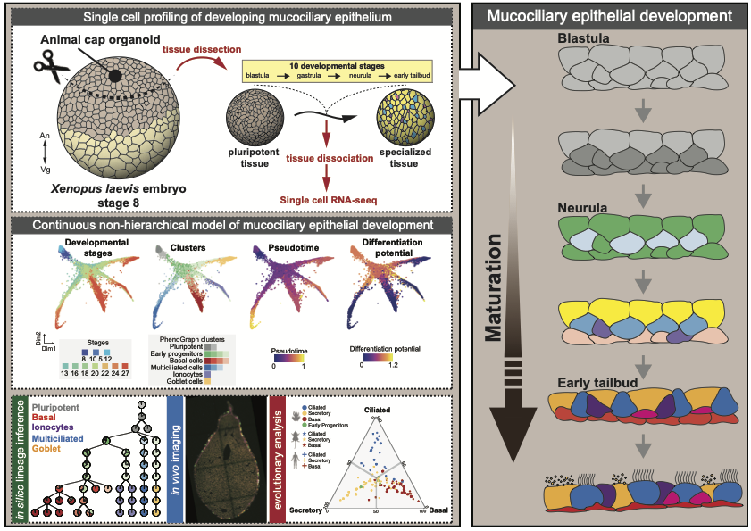

# A single-cell time-resolved profiling of Xenopus mucociliary epithelium reveals non-hierarchical model of development

In this work, we investigate the mucociliary epithelial development in _Xenopus laevis_ through time-course single-cell transcriptomic profiling of 33,990 single-cells over 10 developmental stages.  

This work provides:   
- **I.** Detailed understanding developmental transitions at single-cell level during functional mucociliary epithelial development and differentiation
- **II.** Insights into cell fate paradigms during developing mucociliary epithelial development
- **III.** Comparative evolutionary developmental comparison across lower and higher vertebrates through systematic comparison of 9 single-cell transcriptomics atlases.

The raw dataset is deposited at Gene Expression Omnibus (_GEO:GSE158088_). This repository consists all the analysis notebooks for reproducing the analysis.    
The single-cell transcriptomics data and metadata can be downloaded for offline visualization or interactively visualized at https://cellxgene.cziscience.com/collections/d4055728-b22d-4851-b12d-d7bd0216e8c4.   
_Note: The web version only displays orthologous human gene identifiers over UMAP. The downloadable version include Xenopus gene identifiers, knn-graph coordinates and cell type annotations._
[Twitter thread:]( https://twitter.com/kedar_natarajan)

> _Any requests for materials and code should be addressed to [Jakub Sedzinski](jakub.sedzinski@sund.ku.dk) or [Kedar Natarajan](kenana@dtu.dk)_

### Citation
_Lee J, Møller AF et al_ **A single-cell time-resolved profiling of Xenopus mucociliary epithelium reveals non-hierarchical model of development (2022)** *_Unpublished_*   
The preprint version of this article is available at: [Link](https://doi.org/XXXXX)  

